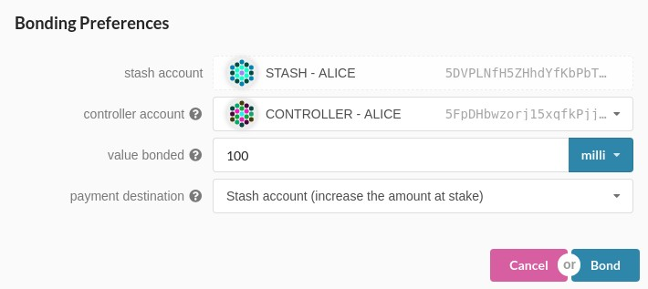

# 如何成为验证人

!!! info
    _这个教程将更新到最新测试网_

想成为一个好验证人，你需要留意以下几点:

- 拥有DOTs作抵押(**基本要求**）
- 确保节点运行最新版本
- 拥有网络保安知识
- 使用HSM保护私钥(**推荐**）

如果你有DOT但是没有足够技术知识，你最好也不要当验证人，反而提议把你的DOTs提名到其它你信任的验证人身上去帮你做这个工作。

你仍然能成为提名人提名多个验证人从而获得奖励。你可以在[这裹](../../../../../polkadot/node/nominator/)了解更多关于提名人的操作。

这个教程我们使用Ubuntu 18.04并将在PoC-4测试网运行，不论你使用那个操作系统，大部份设定也不会有太大区别。另外这里有些[VPS服务器](#vps)给大家选择。

!!! attention
    _请大家确保不要在主网上使用以下设定。
    这个教程将会一步一步教大家如何设定验证人节点，如果你想在主网上线后当验证人，你必须对私钥管理、抵抗DDOS和高可用性(High Availability)有一定了解。_

## 安裝 Rust

```bash
curl https://sh.rustup.rs -sSf | sh
sudo apt install make clang pkg-config libssl-dev
```
以上指令将会下载最新Rust版本并安装，第二个指令是安装其它所需要的程序。

```bash
rustup update
```
假如你经已安装好Rust，执行以上指令检查一下是否有新版本。

## 安装 `Polkadot` PoC-4

在没有一键安装之前，你需要从源代码编译Polkadot。
```bash
git clone https://github.com/paritytech/polkadot.git
# 如果你是更新节点，可以从这一步开始。
cd polkadot
cargo clean
git checkout v0.4
git pull origin v0.4
./scripts/init.sh
./scripts/build.sh
cargo install --path ./ --force
```
编译需要一段时间，具体取决于你的硬件。

## 同步链数据

```bash
polkadot --chain alex
```

同步将会需要数小时。
你可以通过[Telemetry](https://telemetry.polkadot.io/#/Alexander)或[PolkadotJS区块浏览器](https://polkadot.js.org/apps/#/explorer)查看最新区块。

## 创建帐号

第一件事你需要做的是新增三个不同帐号来管理资金和操作验证人:

- Stash
- Controller
- Session (必须是 ed25519)

请看[这裹](../../../../polkadot/learn/keys.md)如果你想了解更多关于以上三个分别和为什么需要它们。


在PolkadotJS区块浏览器选择 [`Accounts`](https://polkadot.js.org/apps/#/accounts)，再按下`Create account`。

为了简单容易识别帐号起见，见议大家把`Stash`、`Controller`和`Session`名为(`1337_Stash`, `1337_Controller`, `1337_Session`)。

Stash和Controller帐号可以使用预设的`sr25519`加密算法，但是當创建**Session**密钥時，你必须在`Advanced creation options`选择`ed25519`加密算法作为`Key pair crypto type`。另外确保你选择`Raw Seed`并储存在本地某个地方，因为当你运行验证人时，那个指令需要使用到它。

每个帐号，输入密码加密种子(Seed)并按下`Save`。


接下来选择*Create and backup account*储存你的密匙为JSON格式。连同密码一起，这是能够恢复帐户的方法。

重复以上步骤创建其它帐号之后，你应该看到三个全新帐号。

## 获取测试币

接下来`Stash`和`Controller`帐号也需要有测试币才能提交交易和参与抵押。而`Session`帐号不需要有DOTs及不建议发送任何币到`Session`，而`Stash`和`Controller`需要有最少100 mDOTs(即0.1 DOTs)的最低金额，另外有多些DOTs允许你作支付交易费用。

现在有二个方法你可以获取测试币。

- [Polkadot Faucet](https://faucet.polkadot.chat) - 在推特发布Tweet附带你的地址，注意每24小时最多能获取300 mDOTs。
- [Blockxlabs Faucet](https://faucets.blockxlabs.com/polkadot) - 需要电邮登录。

如果以上二个方法不行，你需要在[Polkadot Watercooler聊天室](https://riot.im/app/#/room/#polkadot-watercooler:matrix.org)贴下你的地址并请求其它人发给你。只需要贴下一个地址并将接收回来的DOTs发送到其它帐号。

## 绑定 DOTS 

现在可以开始设定验证人，首先我们将会做以下步骤：

- 绑定`Stash`帐号内的DOTs，这里的抵押将会是网络上的安全指标，并会随时因为做了些损害网络的行为被惩罚

- `Controller`，这会负责决定什么时候开始或停止运作验证

- `Session`，这个当你运行节点时需要使用他的Seed

首先前往这里的 [`Staking`](https://polkadot.js.org/apps/#/staking/actions) 页面，你应该会看到你之前所创建的帐号。

选择 `Stash` 帐号，应该有200 mDOTs，之后按`Bond Funds`，我们选择绑定100 mDOTs。



- **Controller account** - 选择你之前创建的`Controller`帐号。
- **Value bonded** - 选择从`Stash`帐号绑定/抵押DOTs数量，因为你需要支付交易费，所以不能够使用全部DOTs作押抵，你之后还可以充值更多，但是提取经已绑定了的DOTs是需要等待一段时间（现在是600个区块）。
- **Payment destination** - 把奖励发送到那个帐号，详情请看[这里](../../../../polkadot/learn/staking.md#reward-distribution).

当所有资料填写好后，利用`Stash`帐号按`Bond`并签署交易。

## 设定 Session Key

现在你应该看到 `Controller` 帐号有 `Set Session Key` 和 `Nominate` 选项。


选择 `Set Session Key`。


选择之前建立的 `Session` 帐号并按下 `Set Session Key`。

## 抵押

现在你应该看到`Controller`帐号有`Validate`和`Nominate`选项，按下`Validate`。


- **Unstake threshold** - 你想被发现多少次离线后，取消验証人资格。
- **Payment preferences** - 验证人会先取下这里设定的奖励，余下那些将会跟提名你的人分享。

按下 `Stake`

打开终端(Terminal)，如果你的节点经已完全同步，利用`Session`帐号的Seed和执行以下指令。

```bash
polkadot \
--chain alex \
--validator \
--key <SESSION_ACCOUNT_SEED> \
--name <在TELEMETRY显示的名称> \
--telemetry-url ws://telemetry.polkadot.io:1024
```

之后前往 [Telemetry](https://telemetry.polkadot.io/#/Alexander)，经过数秒后，你的节点资料将会显示出来。


前往 [Staking apps](https://polkadot.js.org/apps/#/staking) 选择 "Staking Overview"，你应该看到所有运行中的验证人。在最顶部份，你会看到有多少验证人位置空缺和有多少人有意成为验证人。


有意成为验证人的节点将会在*next up*队列显示，每过一小时后，如果有位置空缺或你背后支持的抵押大过排最后那一位验证人，你的节点将会成为验证人。

**恭喜你！**

> 如果你想把你验证人程序变成系统程序，你可以看[这个](../../../../polkadot/node/guides/how-to-systemd.md)教学。

**注意:** 当主网愈近，你可以预计将会有更多验证人位置给大家参与测试。

## VPS 服务器

* [OVH](https://www.ovh.com.au/)
* [Digital Ocean](https://www.digitalocean.com/)
* [Vultr](https://www.vultr.com/)
* [Linode](https://www.linode.com/)
* [Contabo](https://contabo.com/)
* [Scaleway](https://www.scaleway.com/)