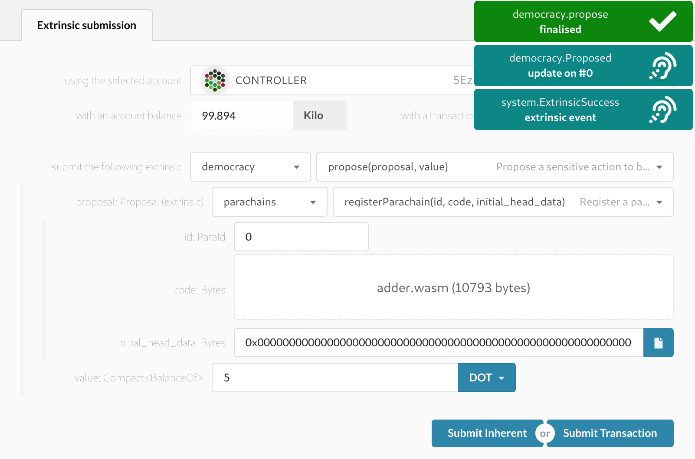
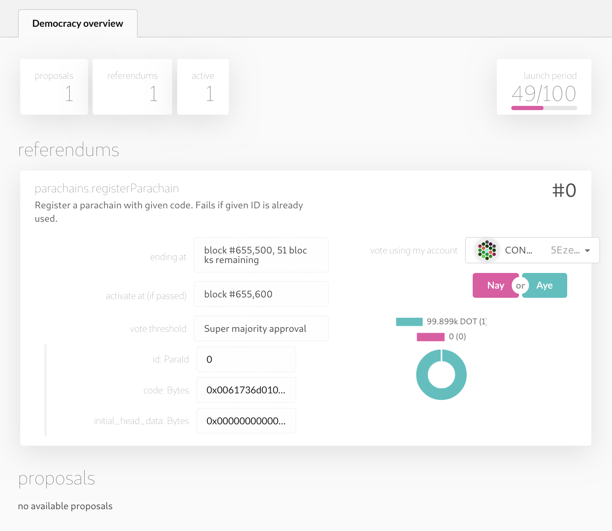
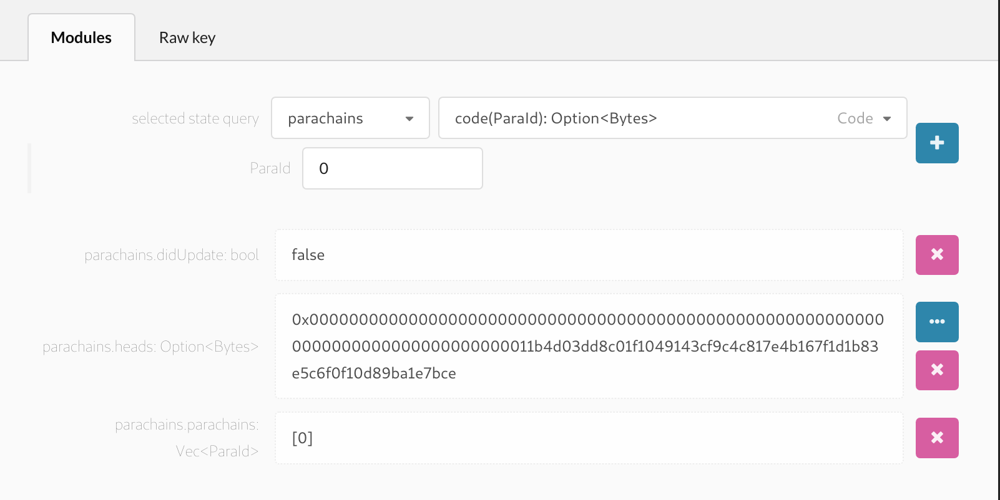

# How to view and deploy parachains

The guide has been updated to work with the Alexander testnet.

## How to view parachains

On the [Polkadot UI](https://polkadot.js.org/apps/#/explorer) navigate to the `Chain State` tab. Select the `parachains` module and the `parachains()` then hit the `+` button. It will return an array of the currently active parachains.

## How to deploy the Adder parachain

**You will need to have the minimum deposit needed to create a referendum. Currently this minimum is 5 DOTs.**

The `adder` parachain is a simple parachain which will keep a value in storage and add to this value as messages are sent to it. It can be found in the Polkadot repository under the `test-parachains` folder.

> A slightly out-of-date video version of this guide presented by Adrian Brink is available [here](https://www.youtube.com/watch?v=pDqkzvA4C0E). When the two guides diverge, please refer to this written text as definitive and updated.

### Building the code

The first step is to download locally the Polkadot code.

```bash
git clone https://github.com/paritytech/polkadot.git
```

Now make sure you have Rust installed.

```bash
curl https://sh.rustup.rs -sSf | sh
sudo apt install make clang pkg-config libssl-dev
rustup update
```

Now navigate to the `test-parachains` folder in the Polkadot code repository and run the build script.

```bash
cd polkadot/test-parachains
./build.sh
```

This will create the  executable of the simple `adder` parachain contained in this folder. This parachain will simply add messages that are sent to it. The  executable will output into the `parachains/test/res/adder.` path so make sure you are able to find it there.

You will need to build and run the collator node in order to get the genesis state of this parachain.

Navigate to the `test-parachains/adder/collator` directory and run the `build` and `run` commands.

```bash
cargo build
cargo run
[ctrl-c]
```

Feel free to stop the collator node right away. You will get some output that looks like this:

```
Starting adder collator with genesis:
Dec: [0, 0, 0, 0, 0, 0, 0, 0, 0, 0, 0, 0, 0, 0, 0, 0, 0, 0, 0, 0, 0, 0, 0, 0, 0, 0, 0, 0, 0, 0, 0, 0, 0, 0, 0, 0, 0, 0, 0, 0, 1, 27, 77, 3, 221, 140, 1, 241, 4, 145, 67,
207, 156, 76, 129, 126, 75, 22, 127, 29, 27, 131, 229, 198, 240, 241, 13, 137, 186, 30, 123, 206]
Hex: 0x00000000000000000000000000000000000000000000000000000000000000000000000000000000011b4d03dd8c01f1049143cf9c4c817e4b167f1d1b83e5c6f0f10d89ba1e7bce
```

The important information is the hex string. This is your genesis state and you will need to save it for the next steps.

### Deploying the parachain

Go to [Polkadot UI](https://polkadot.js.org/apps/#/extrinsics) on the `Extrinsics` tab. Select the account you wish to deploy the parachain from. You will need to create a referendum to deploy the parachain.

Click on `democracy` -> `propose(proposal,value)` -> `parachains` -> `registerParachain(id,code,initial_head_data)`.

In the `id` input enter in the id of the parachain. In the case of the simple adder it will be `100`. In the `code` field click on the page button and then upload the `adder.` binary that was compiled from before. In the `initial_head_data` we will copy and paste the hex data that we got from running the collator node. In the `value` field you will need to input the minimum required value for creating a referendum. At the time of writing this is _5 DOTs_ on the Alexander testnet.



If you navigate to the `Democracy` tab you will be able to see your proposal in the proposals section.

Once you wait for the proposal to become a referendum you will be able to vote `Nay` or `Aye` on it. Assumably, you will vote Aye as this will be a vote for the deployment of your parachain.



After the voting period of your referendum goes through you will be able to query the state of your parachain.

You can go to the `Chain State` tab and by querying the `parachains` state you should be able to see some information on your parchain.



### Interacting with the parachain

_Coming soon_
Wasm