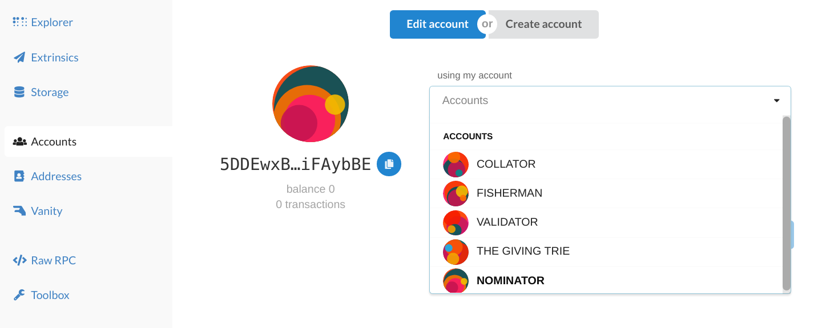
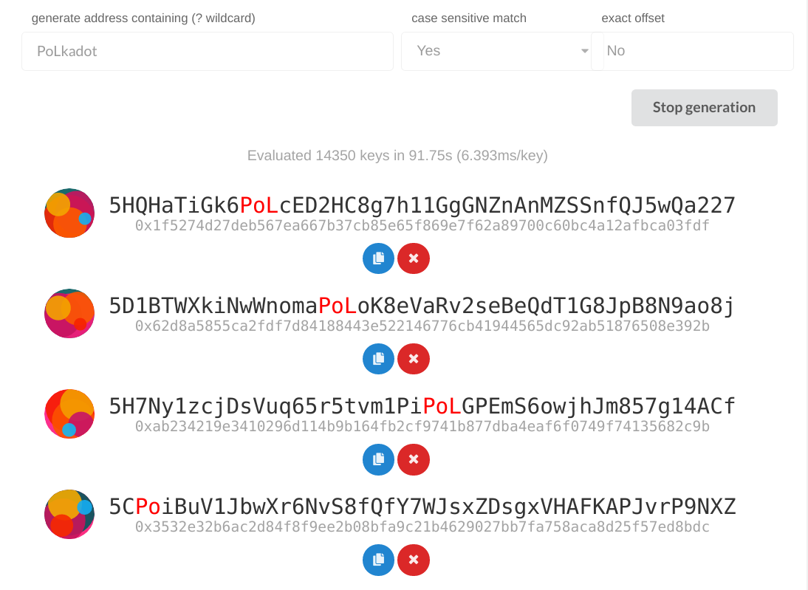
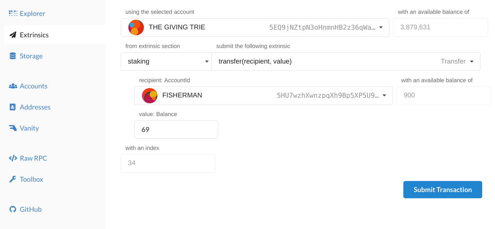

# Polkadot UI

Polkadot comes with an open source, publicly accessible interface that makes it easy for anyone to connect to the Alexander testnet. You can find it [here](https://polkadot.js.org/apps/#/explorer).

## Getting started

By default the Polkadot UI will connect to the Parity hosted node at `wss://poc3-rpc.polkadot.io/`. If you are running your own node locally or on a VPS you can configure it by going into the **Settings** tab and setting a custom node endpoint.

As mentioned the Polkadot UI project is open source and if you're interested in how it works internally you can browse the GitHub repository [here](https://github.com/polkadot-js/apps).

### Creating an account

To create an account navigate to the **Accounts** tab and click on the `Create account` button at the top of the display (it will be chosen by default if you have not already created an account).

### Getting testnet DOTs 

To start playing around on the testnet you will need some testnet DOTs. Click [here](./DOT.md#getting-testnet-dots) to see ways to get testnet DOTs.

### Sending a transaction

Navigate to the **Extrinsics** tab and select your account which has DOTs. Enter the address you want to send DOTs into the `dest:Address` field and the amount to send in the `value: Compact<Balance>` field. Click send transaction and enter your password to unlock your account.

You will notice the value increase in the destination address after a few blocks.

## Navigating around the interface

### Explorer 

The Polkadot explorer lists the validated blocks as they are sealed. Each block listed includes its:

 - Block height/number.
 - Hash.
 - `parentHash` (hash of the previous block).
 - The extrinsics root (merkle root of the ordered mapping of extrinsics, from the index to each extrinsic in the block).
 - State root (merkle root of all the storage).

### Transfer

On this tab you can transfer DOTs to other accounts. The steps to make a transfer are as follows:

1. Select the source account from which to send DOTs.
2. Select the recipient address which will receive the DOTs.
3. Enter the amount of DOTs to transfer.
4. Click the `Make Transfer` button, then the `Sign & Submit` button to send the transfer.

### Staking 

On this tab you can get an overview of the current validators and information about the staking system. You can see how many validators are currently operating and how many empty slots are still available. There is a list of all the validator addresses and as they produce blocks they will update with the latest block number.

On the `Account Actions` you will be able to set your accounts to validate, nominate or stop if they are set as controller. Or you can set a session key and bond DOTs if the account is a stash account.

### Democracy

The Democracy tab shows the current proposals and referendums. 

### Accounts

This page lists your current Polkadot accounts. You can view, edit or create an account. When creating accounts, it's always good practice to back up the private key under the create from the following seed ... field.

### Vanity

Polkadot UI comes with a vanity address generator in the browser. To create a vanity address, enter a string and start hashing. The longer the string, the longer it will take to compute. Note that some characters are not allowed due to the hashing algorithm used in Polkadot.

### Addresses

You can save addresses here for later use. To add a new address to your address book, click the Add address tab at the top.

### Chain State

The **Chain State** tab allows you to query the Polkadot PoC-3 blockchain for statistics and information.

Some useful queries include:

 - `consensus.authorityCount()`: the number of current validators
 - `session.validators()`: the current validators by address, useful for verifying your status as a validator
 - `staking.intentions()`: accounts with the desire to stake and become validators
 - `consensus.code()`: the Wasm code of the current runtime, useful for monitoring changes in the state transition function
 - `system.accountIndexOf(who)`: the number of extrinsics a given account has submitted
 - `staking.freeBalanceOfWho()`: the balance of a given account

### Extrinsics

Extrinsics are the bits of information added to the blockchain, i.e., the things 'extrinsic' from the system. These include transactions, staking, proposing, voting, and many other consensus-level actions.

Start by selecting the account you wish to act with, then choose one of the following extrinsics from the extrinsics section.

### Transferring and staking

From here you can transfer, stake and unstake tokens.

 - transfer(recipient,value) - Transfer by entering the recipient's address in the 'recipient field', then entering the number of DOTs you would like to send.

 - stake() - Stake the entirety of your selected account's balance to become a Validator. However, becoming a Validator requires more than just staking. To get more information on becoming a Validator, read the requirements and tutorial here.

 - unstake() - Unstake the entirety of your selected account's balance to withdraw your bid to be a Validator.

### Toolbox

For hackers interested in submitting Raw RPC calls, you can do so from here. These calls will be updated as Polkadot evolves.

You can also hash data, verify signed messages, and sign messages from your accounts.
